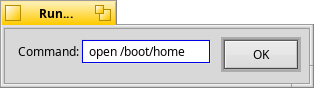

Run Program
==

Run Program is just a simple little app for running a quick Terminal command inspired by Run... by Luke A. Kanies. In addition to being open source, it also completes commands as you type. This includes Tracker, Preferences apps, all regular Terminal commands, and regular apps, too. When bound to a key combination via Shortcuts preferences, this app saves quite a bit of time.

